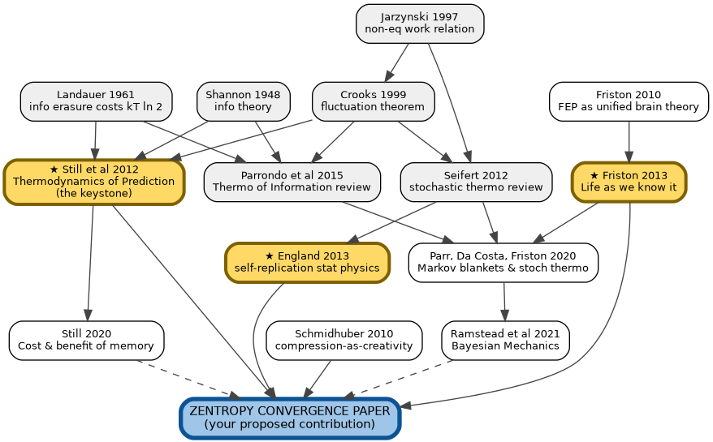

# Zentropy Research Landscape

A visual map of the papers zentropy lives among — what depends on what, what your proposed paper sits on top of, and where you are in the reading queue.

**How to view:** open `landscape.png` directly, or view this file in PyCharm's Markdown preview where the PNG embeds inline. Source of truth is `landscape.dot`; the PNG and SVG are derived outputs.

**Legend:**
- 🟨 yellow nodes — Round 1 reading list (read these first)
- 🟦 blue node — your proposed contribution (the convergence paper)
- ⬜ grey nodes — foundational results you'll back-fill as gaps emerge
- white nodes — adjacent / synthesis-attempt papers (Round 2+)
- solid arrows — direct intellectual dependency
- dashed arrows — informs / motivates, but not load-bearing

---



---

## How to read this map

**Start where the yellow is.** Your three Round 1 papers — Still 2012, England 2013, Friston 2013 — sit on top of the foundation layer (Shannon, Landauer, Jarzynski, Crooks) and feed directly into your proposed convergence paper at the bottom.

**Three intellectual lineages converge into Zentropy:**

1. **The info-thermo lineage** (Shannon → Landauer → Parrondo → Still). This is where prediction, compression, and dissipation get formally linked. Still 2012 is the single most load-bearing node.

2. **The selection lineage** (Jarzynski → Crooks → Seifert → England). This is where non-equilibrium dynamics generate selection pressure on dissipative structures. England 2013 is the load-bearing node.

3. **The free-energy / inference lineage** (Friston 2010 → Friston 2013 → Parr/Da Costa → Ramstead). This is where "life minimizes a free-energy-like quantity" gets developed, with the most recent papers (Parr/Da Costa 2020, Ramstead 2021) attempting exactly the kind of synthesis you'd be extending.

**The Schmidhuber arrow** is the adjacent input from AI / compression-as-fitness — relevant to the substrate-agnosticism claim more than to the core thermodynamic bridge.

## What this DAG says about your paper

Your proposed contribution sits at the joint of all three lineages. The reason it hasn't been written yet is exactly what the graph shows: **the three lineages are weakly cross-cited**. England rarely cites Friston deeply; Friston's collaborators rarely cite England's stat-mech work in detail; Still is cited lightly by both. Each tribe has its own preferred formalism.

A paper that walks the three lineages into a single joint — using Still 2012 as the connective tissue — would be unusual *because of the field's fragmentation*, not because the synthesis is unavailable. That's the gap. The recent Parr/Da Costa and Ramstead papers are partial attempts; they extend Friston toward stoch thermo but don't fully close the loop with England.

## How to re-render

After editing `landscape.dot`:

```bash
dot -Tpng landscape.dot -o landscape.png && dot -Tsvg landscape.dot -o landscape.svg
```

graphviz is already installed locally. The PNG embeds inline above; the SVG scales cleanly for slides or print.

## How to extend

As you read each paper, update `landscape.dot` (the source of truth) and re-render:
- New foundational papers you discover → add as grey nodes upstream
- Papers you discover that cite your Round 1 papers → add downstream
- Papers that suggest the synthesis path forward → add dashed edge to Zentropy
- The PNG/SVG are derived outputs — don't edit them directly
